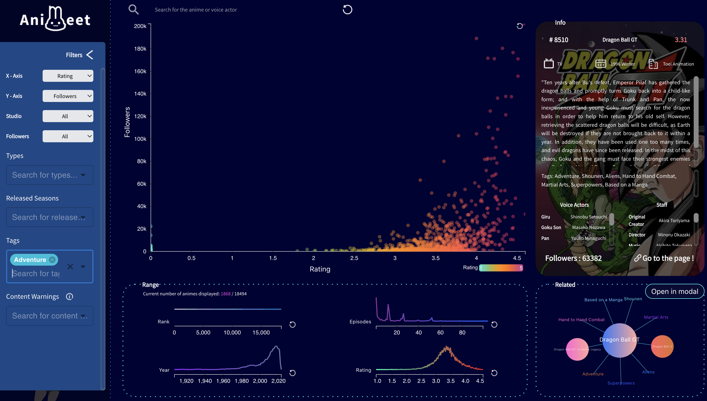

<p align="center">
  
</p>

<p align="center">
  <a href="#get-started">Get Started</a> |
  <a href="https://animeet-nine.vercel.app/">Go to the website</a> |
  <a href="https://vimeo.com/691080491">Demo</a>
</p>


# Animeet  
A web-based visualization tool

## Description
Are you exploring some new animes to watch? Finding one that you like from a huge pool of animes can be difficult. Animeet visualizes all the animes using scatterplot, provides various filters, and offers detailed information! Use Animeet to find out your heart's animes and get the best watching experience.

## Features
**Visualization Mappings**

- Visualize 18000+ animes data through scatterplot, provides an overview of all the aniems.
- Visualize animes through line charts, including *number vs. rank, rating, episodes, followers*.
- Visualize related animes about the selected anime through force-directed graph. 

**Filters**

- Change X/Y Axis of scatterplot to any attribute. 
- Filter animes based on selected *studio, number of followers, types, released seasons, tags, and content warnings*. 


**Searchbox**

- Search one specific anime to check its informaiton and related animes. 
- Search one voice actors to check all the animes that he/she participated in. 
  
**Info Panel**


- Display information of selected anime, including poster, description, tags, voice actors, staff, number of followers, and etc. 


## Data 
The data is from [Kaggle dataset](https://www.kaggle.com/vishalmane10/anime-dataset-2022), that scrapes anime data from the [anime planet website](https://www.anime-planet.com/). It contains 18494 animes. 

We also scraped the anime poster and followers’ data from the website by ourselves and did data cleansing to come up with the final dataset. The data won’t be profitable and is only used for learning purpose. The data is last updated on 2022-01-16.


## [Team](https://animeet-nine.vercel.app/team)

<p align="center">
  
</p>

## Website 
Check our <a href="https://animeet-nine.vercel.app/">website</a> to explore more!



## Get Started 
Animeet is built using React. The preprocessed dataset is loaded through papaparse, then extracted and modified based on different usage. We have imported several libraries to support components development and dataflow, such as react-redux and react-router-dom. For a rapid build of customized user interface, we select tailwindcss as the CSS framework. 
### Build 

```
npm install 
npm start
```